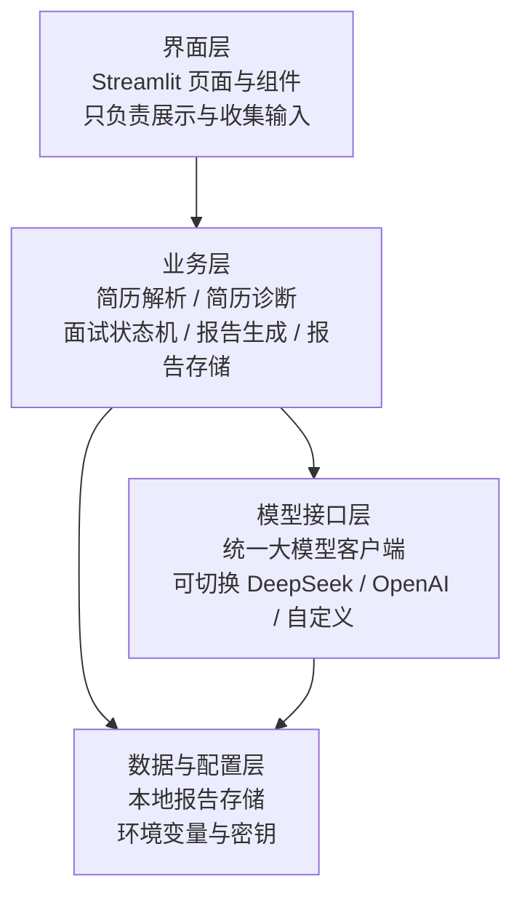

# 架构文档

## 一、分层架构（核心原则）

系统分四层，**严格单向依赖**，禁止跨层调用；上层只能调用相邻下层，同层模块之间不直接调用，统一通过服务接口通信。



## 二、模块职责

| 模块 | 层级 | 职责 | 禁止做的事 |
| --- | --- | --- | --- |
| `ui/*` | 界面层 | 展示、收集输入、调用业务层 | 直接调用模型接口、直接读写文件 |
| `services/resume_parser` | 业务层 | 解析粘贴文本 / PDF / Word | 不调用模型 |
| `services/resume_diagnosis` | 业务层 | 组织简历诊断提示词并解析结果 | 不处理界面逻辑 |
| `services/resume_clarification` | 业务层 | 提取简历缺失项、生成待确认问题、合并补充信息 | 不处理界面逻辑 |
| `services/interview_service` | 业务层 | 面试流程状态机（题号、历史、状态） | 不直接调用模型 |
| `services/report_service` | 业务层 | 生成并解析面试报告 | 不处理界面逻辑 |
| `services/report_store` | 业务层 | 报告本地保存 / 读取 / 列出 | 不调用模型 |
| `services/job_catalog` | 业务层 | 岗位方向常量 | 只提供数据 |
| `llm/config` | 模型接口层 | 读取配置、提供提供方预设 | 不包含业务规则 |
| `llm/client` | 模型接口层 | 统一调用大模型、超时重试、错误包装 | 不写业务提示词 |
| `llm/prompts` | 模型接口层 | 各功能的提示词模板 | 不调用接口 |
| `models/*` | 契约层 | 各层之间的固定数据结构 | 不含逻辑 |

## 三、接口契约（固定数据结构）

### ResumeData（简历解析结果）

```python
ResumeData:
  content: str          # 纯文本内容
  source_type: str      # paste / pdf / docx
  filename: str | None  # 上传文件名
  char_count: int
  is_empty: bool
  too_short: bool       # 内容过短，提示用户补充
```

### ResumeProfile / ClarificationItem（简历补充信息）

```python
ResumeProfile:
  school: str
  target_location: str
  target_direction: str
  extra_notes: str
  market_notes: str          # 用户补充的当地市场信息

ClarificationItem:
  field: str                 # school / target_location / target_direction / 其他
  question: str              # 向用户展示的问题
  hint: str
  answer: str                # 用户填写内容（界面层设置）
```

### DiagnosisResult（简历诊断结果）

```python
DiagnosisResult:
  score: int                 # 0-100
  overall_evaluation: str
  strengths / weaknesses / suggestions: list[str]
  optimized_examples: list[str]
  requirement_table: list[dict]  # 岗位要求 × 证据 × 证据强度 × 差距
  top_priorities: list[str]      # 最优先修改建议 3 条
  market_notes: str              # 当地市场提示
```

### InterviewState（面试状态）

```python
InterviewState:
  job_label: str
  questions: list[str]
  answers: list[str]    # 与 questions 一一对应
  follow_up_questions: list[str]  # 每题最多一条追问
  follow_up_answers: list[str]
  current_index: int
  status: str           # ready / in_progress / finished
  phase: str            # main / answered_main / followup / answered_followup / done
```

### InterviewReport（面试报告）

```python
InterviewReport:
  report_id: str
  created_at: str
  job_label: str
  dimensions: dict[str, int]   # 五个维度，各 0–10 分
  total_score: int             # 0–100 分
  strengths: list[str]
  weaknesses: list[str]
  reference_answers: list[dict]  # [{question, answer}]
  suggestions: list[str]
```

### LLMConfig（模型配置）

```python
LLMConfig:
  provider: str    # deepseek / openai / custom / mock
  base_url: str
  api_key: str
  model: str
  timeout: int
  mock: bool       # 模拟演示模式
```

## 四、调用链示例

1. 用户在"简历诊断"页粘贴文本 → 界面层把文本交给 `resume_parser`。
2. `resume_parser` 返回 `ResumeData`，界面层展示摘要。
3. 界面层调用 `resume_diagnosis` 服务 → 服务组织提示词 → 调用 `llm/client`。
4. `llm/client` 把结果返回 → 服务解析为固定结构 → 界面层渲染。
5. 出问题时按层定位：界面异常查 `ui/*`，结果格式异常查 `services/*`，请求失败查 `llm/*`，密钥配置查 `.env`。

## 五、错误处理约定

- 模型层所有失败统一包装为 `LLMError`，带中文可读信息（密钥无效、余额不足、超时等）。
- 业务层负责把模型输出解析失败转为"请重试"的友好提示，不把原始报错抛给用户。
- 界面层只负责提示与重试入口，不吞掉错误也不直接展示堆栈。

## 六、扩展方式

- **换模型**：只改 `.env` 中的 `LLM_PROVIDER / LLM_BASE_URL / LLM_MODEL / LLM_API_KEY`，业务代码零改动。
- **加功能**：新增一个业务服务 + 一个界面模块，按同样契约接入。
